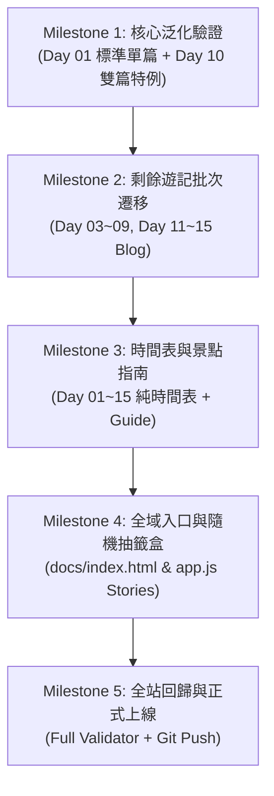

# 📋 2026 Germany 批次遷移標準作業程序與防禦性工程合約 (MIGRATION_PLAN.md)

> **生效區間**：2026 Germany 15 天全站遷移期間  
> **核心目標**：確保在批次遷移 15 天遊記與圖資時，嚴格遵循「最小化設計」、「SSoT 邊界防護」與「零 404 死鏈驗收」，避免工程跑偏或發布事故。

---

## 1. 核心邊界與 SSoT 契約

1. **Legacy Import Source**：
   - 舊目錄 `Travelplan/2026 Germany/` 僅作為**唯讀匯入來源 (Read-Only Legacy Source)**，嚴禁直接更動舊目錄。
2. **專案 SSoT**：
   - 原始相機照片與 Takeout 來源匯入後，以 `masters/2026-germany/day-xx/` 作為本專案唯一原始圖庫事實來源（受 `.gitignore` 隔離，**絕不公開、不進 Git**）。
   - 原始 HTML 模板匯入後，以 `trips/2026-germany/sources/` 作為本專案構建事實來源。
3. **公開發布目錄**：
   - `docs/` 僅存放 480w～1600w WebP 衍生圖與純 HTML/CSS/JS（零構建依賴、零原始相機大檔、零 EXIF/GPS 隱私資訊）。

---

## 2. 遷移七大黃金準則 (Invariants)

1. **小步閉環，杜絕全量爆炸**：
   - 嚴禁一次將 611 張照片、30+ HTML 全量轉檔後直接發布。
   - 必須分 Milestone 漸進遷移，每步完成「圖資 ➜ HTML ➜ Validator ➜ 本機 UAT」完整閉環。
2. **Config 驅動構建**：
   - 所有天數之 `slug`、`source`、`output`、`prev_link`、`next_link`、`image_folder` 必須在 `trips/2026-germany/blog-migration.json` 中宣告，禁止在構建腳本中 hardcode 特例。
3. **Day 10 雙篇命名規範**：
   - 上半天（施派爾）：`day-10-speyer-blog.html`
   - 下半天（科爾馬）：`day-10-colmar-blog.html`
   - 導覽鏈結：Day 09 ➜ Day 10 (上) ➜ Day 10 (下) ➜ Day 11。
4. **零 404 死鏈契約**：
   - 尚未生成的頁面，在頁面上**不得使用 `<a>` 標籤**，改以純文字或 `(即將推出)` 標記。
5. **圖片發布 Playbook 規格**：
   - 尺寸上限：480w (Thumb), 960w (Content), 1200w (Desktop), 1600w (Lightbox Max)。
   - 格式：WebP (quality 84)，禁止 upscale，100% 剝除 EXIF/GPS。
6. **保持單執行緒與冪等快取**：
   - 圖檔管線優先保持單執行緒與 `source_hash` 快取，確保輸出 100% 可重現，不追求未經量測的多執行緒過早優化。
7. **發布前三重門禁**：
   - 執行 `tools/validate_images.py` 必須 100% 通過（無死鏈、無 `.jpg`、無舊網址）。
   - 本機 `tools/server.py` 完成瀏覽器端 UAT。
   - 獨立 Git Commit，取得確認後方可 Push。

---

## 3. 分段實施里程碑 (Milestones)

### Milestone 1：核心泛化最小閉環 (當前焦點)
- **目標樣本**：
  - `Day 01`：標準單篇起點
  - `Day 10`：施派爾與科爾馬雙篇特例
- **驗收標準**：
  - Day 01 ➜ Day 02 連結通暢。
  - Day 10 (上) ➜ Day 10 (下) 雙向導覽無誤，且未生成的 Day 09/11 無 404。
  - `validate_images.py` 100% Pass。

### Milestone 2：剩餘深度遊記遷移
- **目標天數**：Day 03, 04, 05, 06, 07, 08, 09, 11, 12, 13, 14, 15（共 12 天遊記）。
- **驗收標準**：全站 16 篇深度圖文遊記首尾互相鏈結連通。

### Milestone 3：純時間表與專題指南
- **目標**：遷移 `day-01.html` 至 `day-15.html` 與景點微指南。
- **驗收標準**：15 天時間軸按鈕全數可點擊切換。

### Milestone 4：全域入口與隨機故事盒
- **目標**：更新 `docs/index.html` 與 `core/js/app.js` 隨機故事抽籤盒。
- **驗收標準**：首頁「🎲 換一批」隨機抽取之 16 篇故事皆能正常加載 WebP 圖檔與對應網址。

### Milestone 5：全站終審與正式發布
- **驗收標準**：
  - `python tools/validate_images.py` 全站 30+ HTML、2,500+ WebP 檔案 100% 通過。
  - 獨立 Commit，提交並推播至 GitHub Pages。
