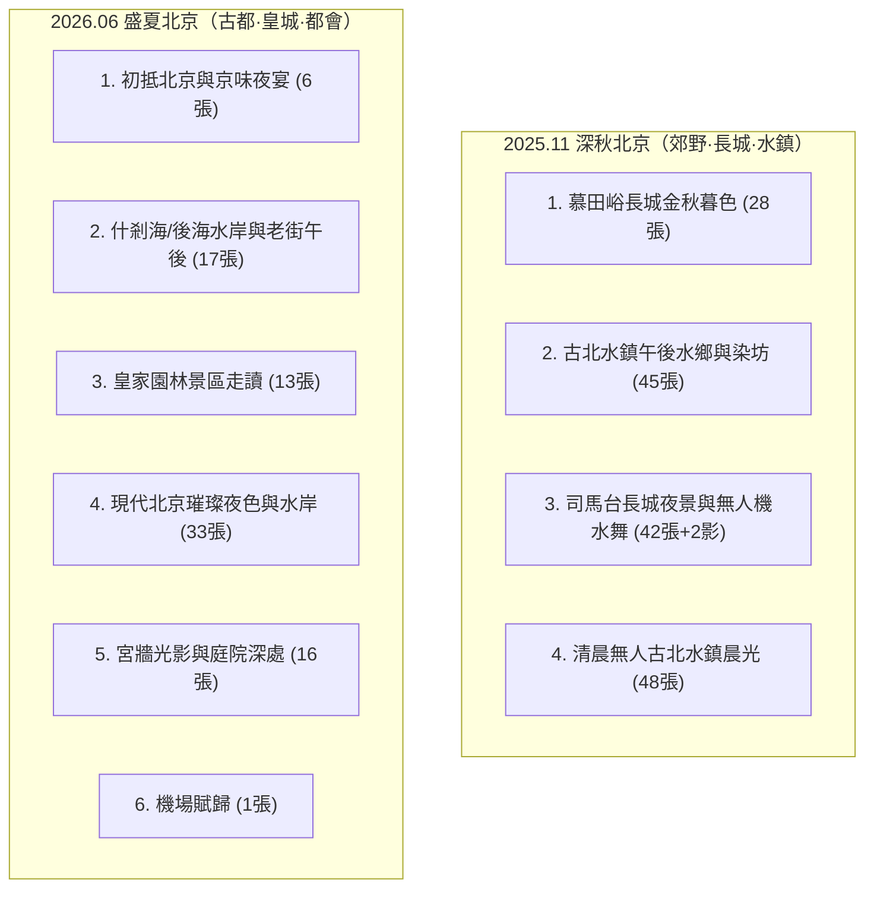

# 🇨🇳 CH Travel OS — 北京旅程素材 Intake 與照片技術盤點報告 (PHOTO_AUDIT.md)

> **文件狀態**：素材 Intake 審計報告（唯讀盤點，不代表正式 URL、不建立 Journey Namespace）  
> **盤點日期**：2026-08-30  
> **來源目錄**：`C:\Users\aa166\Downloads\Mobile Devices\`（唯讀檢視）  
> **執行規範**：嚴格依據 `AGENTS.md`、`TRAVEL_BLOG_PRODUCTION_PLAYBOOK.md`、`EDITORIAL_STYLE_GUIDE.md` 與 `TRAVEL_PORTAL_ROADMAP.md`

---

## 一、Executive Summary (盤點總結)

本次盤點完整掃描了 `Mobile Devices` 目錄下屬於北京兩次獨立旅程的所有原始照片與影片：
1. **2025 年 11 月北京行（郊野自然 ✕ 雙長城 ✕ 古北水鎮）**：
   - 包含 **慕田峪長城**、**古北水鎮** 與 **司馬台長城**。
   - 總檔案數：204 個（含 34 個 bitwise MD5 重複檔）。
   - **去重後唯一素材：170 個**（168 張 JPG 照片 + 2 部 MP4 影片）。
   - **技術特性**：拍攝設備全數為 **Samsung Galaxy S23**；直式照片佔極高比例（直式 143 張 / 橫式 25 張），慕田峪長城僅有 2 張橫式照片，需精準運用。
2. **2026 年 6 月北京行（市區古都 ✕ 皇城園林 ✕ 繁華夜色）**：
   - 包含 5 天 4 夜的市區漫步、歷史景區、古建築群、水岸綠意與現代都會夜景。
   - 總檔案數：86 個（零重複）。
   - **去重後唯一素材：86 張 JPG 照片**。
   - **技術特性**：拍攝設備全數為 **Samsung Galaxy S23**；橫直比例均衡（橫式 41 張 / 直式 45 張），擁有豐富的高品質橫式主圖與夜景大景。

---

## 二、來源目錄與技術統計

### 1. 來源資料夾掃描總覽

| 資料夾名稱 | 實體檔案數 | 格式分佈 | EXIF 拍攝時間範圍 | 橫直構圖比例 | 重複檔案情況 |
| :--- | :---: | :---: | :---: | :---: | :--- |
| **`2025.11.12 慕田裕長城(橫式)`** | 2 | 2 JPG | 2025:11:12 15:30 ~ 16:27 | 橫 2 / 直 0 | 零重複 |
| **`2025.11.12 慕田裕長城(直式)`** | 26 | 26 JPG | 2025:11:12 15:31 ~ 16:26 | 橫 0 / 直 26 | 零重複 |
| **`2025.11.14 古北水鎮(橫式)`** | 23 | 23 JPG | 2025:11:14 15:45 ~ 11:15 10:39 | 橫 23 / 直 0 | 零重複 |
| **`2025.11.14 古北水鎮(直式)`** | 117 | 115 JPG, 2 MP4 | 2025:11:14 14:11 ~ 11:15 10:51 | 橫 0 / 直 115 (2 影片) | 零重複 |
| **`2025.11.15 古北水鎮精選`** | 36 | 34 JPG, 2 MP4 | 2025:11:14 14:11 ~ 11:15 10:15 | 橫 0 / 直 34 (2 影片) | **34 個檔案為直式庫 100% 相同副本**；僅 2 張為獨立獨有圖 (`20251114_144547.jpg`, `144557.jpg`) |
| **`2026.06 北京行`** | 86 | 86 JPG | 2026:06:12 21:01 ~ 06:16 17:56 | 橫 41 / 直 45 | 零重複 |
| **總計 (Total)** | **290** | **286 JPG, 4 MP4** | — | — | **去重後唯一素材：256 個** |

---

## 三、2025.11 北京行技術盤點（170 個唯一素材）

### 1. 技術特性與時間分佈
- **日期分佈**：
  - **2025.11.12 (週三)**：28 張（15:30–16:27，慕田峪長城深秋金色斜陽）
  - **2025.11.14 (週五)**：111 張 + 2 影片（14:11–22:41，古北水鎮抵達、午後水鄉、司馬台長城夜景與無人機水舞秀）
  - **2025.11.15 (週六)**：31 張（08:37–10:51，清晨古北水鎮晨光、石板路漫步與返程）
- **拍攝裝置**：Samsung Galaxy S23 (SM-S9110)，主鏡頭 5.4mm (等效 23mm) 居多，望遠 7.0mm (等效 70mm) 輔助。
- **構圖比例**：
  - **橫式 (Landscape)**：25 張 (14.7%) ⚠️ *橫式較少，需謹慎作為各篇 Hero 與主視覺*。
  - **直式 (Portrait)**：143 張 (84.1%) ⭐️ *極適合 IG 卡片、旅人散文雙拼/三拼與直式燈箱*。
  - **動態影片**：2 部 (`20251114_194354.mp4`, `20251114_204359.mp4`，古北水鎮夜間無人機燈光水舞秀)。

### 2. 重複、連拍與品質異常檢查
- **MD5 完全相同副本**：`2025.11.15 古北水鎮精選` 內有 34 張照片/影片與 `2025.11.14 古北水鎮(直式)` 內容完全一致，後續正式建庫時可直接去重。
- **連拍/近似角度**：
  - 慕田峪長城烽火台石階：`20251112_154623`、`154659`、`154752` 為同角度連續取景。
  - 司馬台長城夜間燈帶：`20251114_181631`、`181639`、`181855`、`182119` 為連續測光連拍。
  - 永順染坊布幔：`20251114_163821`、`163903` 等為多角度取景。
- **模糊/曝光過度/失敗片**：
  - 夜間長城遠眺部分手持微震（需挑選對焦銳利者如 `20251114_182442.jpg`）。
  - 無嚴重損壞或無法解碼檔案。

### 3. 隱私與公開風險
- **人物肖像**：部分照片含同行家人或遊客背影/半身（如長城纜車、水鎮石橋）。**需作者確認是否可公開或僅作氛圍景深**。
- **證件/票券/QR Code**：未發現明顯護照或機票特寫；部分景區入口標牌含一般導覽 QR Code。

---

## 四、2026.06 北京行技術盤點（86 個唯一素材）

### 1. 技術特性與時間分佈
- **日期分佈（5 天 4 夜）**：
  - **2026.06.12 (Day 1)**：6 張（21:01–22:22，夜間抵達、北京烤鴨/胡同特色餐飲）
  - **2026.06.13 (Day 2)**：17 張（08:48–19:06，上午古蹟/寺廟走讀 ➔ 下午什剎海/後海/水岸漫步 ➔ 晚餐）
  - **2026.06.14 (Day 3)**：46 張（09:47–22:15，午後大型歷史園林/古建築 ➔ 傍晚湖畔日落 ➔ 奧林匹克/亮馬河/繁華夜景）
  - **2026.06.15 (Day 4)**：16 張（16:30–17:34，紅牆古建築、皇家園林、石階與庭院）
  - **2026.06.16 (Day 5)**：1 張（17:56，機場候機返程機翼與跑道天際線）
- **拍攝裝置**：Samsung Galaxy S23，廣角 (2.2mm)、主鏡 (5.4mm) 與望遠 (7.0mm) 靈活切換。
- **構圖比例**：
  - **橫式 (Landscape)**：41 張 (47.7%) ⭐️ *橫式充足，夜景與水岸大景極具視覺衝擊力*。
  - **直式 (Portrait)**：45 張 (52.3%)。

### 2. 重複、連拍與品質異常檢查
- **零 MD5 重複**。
- **連拍/近似照片**：
  - 6/14 夜景燈光秀：`20260614_211922` 與 `211937`、`214454` 與 `214502`、`220457`~`220523`（城市天際線燈火連拍，可精選 1~2 張代表）。
  - 6/15 宮牆與窗櫺：`20260615_163530` 與 `163608` 為同一角度測光。
- **技術品質**：夜景噪點控制極佳（S23 夜景模式純淨），日光古建築細節清晰。

---

## 五、場景與故事群組 (Story Scene Clusters)

### 群組 A：2025.11 慕田峪長城（深秋 15:30–16:30）
- **照片數量**：28 張（2 橫 / 26 直）。
- **代表照片**：
  - 橫式：`20251112_153025.jpg`（山脊長城延伸全景）、`20251112_162724.jpg`（夕陽斜照敵樓金光）。
  - 直式：`20251112_154236.jpg`（長城石階與遠山層疊）、`20251112_155943.jpg`（敵樓框景）。
- **故事強度**：⭐️⭐️⭐️⭐️⭐️（極高）。11 月深秋金色陽光、遊客稀少、險峻山勢與長城滄桑感強烈。
- **橫式評估**：僅有 2 張橫式，**剛好可作為 Hero 與一篇核心大圖**；其餘需搭配直式雙拼/三拼。

### 群組 B：2025.11 古北水鎮·初抵與午後漫步（11/14 14:00–17:00）
- **照片數量**：45 張（7 橫 / 38 直）。
- **代表照片**：
  - 橫式：`20251114_160254.jpg`（水鎮運河與遠處司馬台長城眺望）、`20251114_160539.jpg`（石橋水岸倒影）。
  - 直式：`20251114_141407.jpg`（紅葉石牆）、`20251114_152115.jpg`（水鎮街道）、`20251114_163903.jpg`（永順染坊高掛印花布幔）。
- **故事強度**：⭐️⭐️⭐️⭐️（高）。北方水鄉在秋末的清冷、紅葉與傳統手工藝染坊。

### 群組 C：2025.11 司馬台長城夜色與水鎮夜宴（11/14 18:00–23:00）
- **照片數量**：42 張 + 2 影片（11 橫 / 31 直）。
- **代表照片**：
  - 橫式：`20251114_182119.jpg`（司馬台長城金色燈火巨龍）、`20251114_201844.jpg`（水鎮湖畔夜景倒影）。
  - 直式：`20251114_192955.jpg`（望京街夜燈）、`20251114_223939.jpg`（夜深人靜的石板弄堂）。
- **故事強度**：⭐️⭐️⭐️⭐️⭐️（極高）。長城夜間點燈是極少數開放夜遊的長城奇景，水舞與燈光秀氛圍獨特。

### 群組 D：2025.11 古北水鎮·清晨藍調與晨光（11/15 08:30–11:00）
- **照片數量**：48 張（5 橫 / 43 直）。
- **代表照片**：
  - 橫式：`20251115_093447.jpg`（晨光灑落水鎮與山巒）。
  - 直式：`20251115_085909.jpg`（無人石橋晨景）、`20251115_090842.jpg`（水岸柳樹與靜謐長巷）。
- **故事強度**：⭐️⭐️⭐️⭐️（高）。住一晚才能獨享的「無遊客清晨水鎮」，與前一晚的喧鬧夜景形成反差。

---

### 群組 E：2026.06 盛夏抵達與京味夜宴（6/12 21:00–22:30）
- **照片數量**：6 張（3 橫 / 3 直）。
- **代表照片**：`20260612_210110.jpg`（北京特色烤鴨/京菜桌面）、`20260612_213408.jpg`（夜間街景）。
- **故事強度**：⭐️⭐️⭐️（中）。適合做為 2026 旅程開篇「六月重返北京」的過渡序曲。

### 群組 F：2026.06 水岸老街與歷史走讀（6/13 全天）
- **照片數量**：17 張（8 橫 / 9 直）。
- **代表照片**：
  - 橫式：`20260613_084802.jpg`（晨間街區）、`20260613_164818.jpg`（水岸垂柳與古橋）、`20260613_190600.jpg`（古色古香建築與晚餐氛圍）。
  - 直式：`20260613_163854.jpg`（什剎海/後海水岸綠蔭）。
- **故事強度**：⭐️⭐️⭐️⭐️（高）。盛夏綠意盎然的北京水岸，與 2025 年 11 月的枯枝秋景形成極鮮明季節對照。

### 群組 G：2026.06 皇家園林古建 ✕ 繁華都會夜景（6/14 全天）
- **照片數量**：46 張（25 橫 / 21 直）。
- **代表照片**：
  - 橫式：`20260614_193405.jpg`（黃昏暮色水岸天際線）、`20260614_211922.jpg`（璀璨城市夜景/光影水岸）、`20260614_220117.jpg`（現代北京夜間建築燈火）。
  - 直式：`20260614_151354.jpg`（古典園林綠蔭古樹）、`20260614_195512.jpg`（藍調晚霞）。
- **故事強度**：⭐️⭐️⭐️⭐️⭐️（極高）。照片數量最多、橫式最豐富的一天，涵蓋白天皇家古蹟園林到入夜後的現代璀璨北京。

### 群組 H：2026.06 宮牆光影與古建築深處（6/15 16:30–17:34）
- **照片數量**：16 張（4 橫 / 12 直）。
- **代表照片**：
  - 橫式：`20260615_165158.jpg`（古建築大殿屋脊獸與天空）、`20260615_170017.jpg`（庭院迴廊）。
  - 直式：`20260615_163113.jpg`（經典紅牆與綠樹掩映）、`20260615_165759.jpg`（殿宇樑柱細節）。
- **故事強度**：⭐️⭐️⭐️⭐️（高）。高對比度的紅牆黃瓦與夏日斜陽，極具傳統京城厚重美感。

---

## 六、Hero 候選推薦 (Hero Photo Candidates)

依 Travel OS 2.0 標準（橫式寬幅、桌面 16:9 / 手機 4:3 裁切安全、高畫質、具備全篇靈魂）：

### 1. 2025.11 旅程 Hero 候選 (3 張)

| 序號 | 檔名 | 原始尺寸 | 畫面焦點與題材 | 適合主題 / 篇章 | 裁切與隱私評估 |
| :---: | :--- | :---: | :--- | :--- | :--- |
| **H1** | `2025.11.12 慕田裕長城(橫式)/20251112_153025.jpg` | 4000x2252 (16:9) | 慕田峪長城巨龍盤踞於深秋金黃山脊，遠山層巒疊嶂 | **2025 旅程總封面** 或 **慕田峪長城專刊 Hero** | ✅ 主體居中偏右，16:9 原生比例，手機居中裁切安全；無隱私人物。 |
| **H2** | `2025.11.14 古北水鎮(橫式)/20251114_160254.jpg` | 4000x2252 (16:9) | 古北水鎮水道、拱橋石屋與遠方司馬台長城山脊同框 | **古北水鎮午後專刊 Hero** | ✅ 景深層次豐富，上方為長城、下方為水鄉；無隱私問題。 |
| **H3** | `2025.11.14 古北水鎮(橫式)/20251114_182119.jpg` | 4000x2252 (16:9) | 夜間司馬台長城點燈金線與水鎮萬家燈火相互輝映 | **司馬台長城夜景與水舞 Hero** | ✅ 極具視覺衝擊力，暗部噪點控制佳；無隱私問題。 |

### 2. 2026.06 旅程 Hero 候選 (3 張)

| 序號 | 檔名 | 原始尺寸 | 畫面焦點與題材 | 適合主題 / 篇章 | 裁切與隱私評估 |
| :---: | :--- | :---: | :--- | :--- | :--- |
| **H4** | `2026.06 北京行/20260614_193405.jpg` | 4000x2252 (16:9) | 傍晚水岸夕陽暮色，水面如鏡倒映城市天際線 | **2026 旅程總封面** 或 **水岸日落專刊 Hero** | ✅ 色調溫潤，天空與水面留白充足，手機裁切安全；無人物。 |
| **H5** | `2026.06 北京行/20260614_211922.jpg` | 4000x2252 (16:9) | 現代都會繁華夜景，璀璨燈火倒映於水面 | **當代北京夜色切片 Hero** | ✅ 橫幅大景，視覺張力極強；無隱私問題。 |
| **H6** | `2026.06 北京行/20260615_165158.jpg` | 4000x2252 (16:9) | 古建築歇山頂簷角脊獸特寫，藍天與紅牆光影交織 | **古都宮牆與園林建築 Hero** | ✅ 建築構圖嚴謹，經典北京古都視覺；無人物。 |

---

## 七、兩次旅程可形成的精彩對照 (First Visit vs. Revisit)

兩次北京行程相隔僅 **7 個月**（2025 年 11 月深秋 vs. 2026 年 6 月盛夏），在素材上形成了完美的 **自然與都會、季節與空間** 雙重對照：

| 比較維度 | 2025.11 第一次北京行 | 2026.06 第二次北京行 | 可展開的敘事深度 |
| :--- | :--- | :--- | :--- |
| **空間場域** | **京郊大山大水**（懷柔慕田峪長城 ✕ 密雲古北水鎮/司馬台） | **城內人文肌理**（市區水岸、歷史園林、宮牆、繁華商圈） | 「站在長城邊緣遠眺文明」vs「走入古都核心體驗生活」。 |
| **季節色彩** | **深秋清冷蕭瑟**（金黃秋葉、灰褐山脊、冷風斜陽、夜間低溫） | **盛夏綠意與水波**（垂柳依依、滿池荷葉、清澈湖水、璀璨夜宴） | 同一座北方古都，在半年間展現的兩種極致季節風貌。 |
| **視覺節奏** | **大景與長城巨龍**（登高爬梯、石階烽火台、水鄉夜燈） | **細節與生活切片**（宮牆光影、水岸散步、夜市美食、都會天際線） | 從遊客式的壯闊朝聖，轉化為旅人式的漫步回甘。 |

---

## 八、隱私與公開風險檢核

1. **家庭與人物肖像**：
   - 慕田峪長城石階與水鎮石橋有少數帶有人物背影/行進身影的照片。
   - **處置原則**：未獲作者授權前，不將清晰正面人像設為公開 Hero 或文章第一主圖；若作者確認可公開，則保留作為家庭時光真實證據。
2. **商業與餐飲場所**：
   - 包含烤鴨菜色與餐廳內部照片，無涉及私密資訊，可正常作為美食與生活感插圖。
3. **無機密或敏感檔案**：
   - 經檢查無登機證、護照號碼、飯店房號或住址特寫洩漏。

---

## 九、橫式照片缺口與補充需求 (Gaps & Inquiries)

1. **慕田峪長城橫式嚴重不足**：
   - 28 張長城照片中僅有 **2 張橫式** (`20251112_153025.jpg` 與 `162724.jpg`)。
   - 若長城要寫成獨立長篇專刊，需依賴大量「直式雙拼 (`.story-split`)」與「直式三拼」來排版。
   - **需向作者確認**：是否有其他相機或手機拍的橫式長城全景？
2. **古北水鎮室內/餐飲照片較少**：
   - 照片多集中於戶外水道、石橋與夜景，客棧內部或特色餐飲照片較少。

---

## 十、待作者確認的關鍵問題清單 (10 Questions for Author)

1. **【旅伴與同行組合】**：兩次北京行分別是獨旅、夫妻同行、或是三千金家庭出遊？
2. **【2025 交通方式】**：從北京城區前往慕田峪長城與古北水鎮是包車、搭乘專線巴士（景區直通車）還是高鐵轉接駁？（*已確認非自駕*）
3. **【2025 慕田峪路線】**：長城當天是搭乘纜車上、滑道 (Toboggan) 下，還是徒步登城？
4. **【2025 水鎮住宿】**：在古北水鎮是否留宿一晚（入住哪間客棧/飯店）？留宿體驗與清晨無人水鎮的心得為何？
5. **【2026.06 行程重點地點】**：6/13、6/14、6/15 造訪的古建築群與園林，具體包含哪些景點（如恭王府、雍和宮、故宮、天壇、什剎海、頤和園等）？
6. **【2026.06 夜景地點】**：6/14 晚上璀璨的現代水岸夜景是哪裡（如亮馬河國際風情水岸、前門、三里屯或是奧林匹克公園）？
7. **【兩次造訪的心境轉折】**：為什麼會在半年內（11月與隔年6月）兩次前往北京？兩趟旅行在心境、節奏與感受上有何最大不同？
8. **【人物公開界限】**：照片中若有家人背影或側面身影，是否允許於 Travel OS 公開呈現？
9. **【是否有遺漏的橫式照片】**：長城或市區是否有其他橫式照片可補充？
10. **【架構偏好】**：未來希望規劃為 **「兩本獨立 Journey 專刊（2025 深秋長城水鎮 ✕ 2026 盛夏京城漫步）」**，還是以 **「重返現場：夏與冬的雙城對照」** 形式呈現？

---

## 十一、建議下一步 (Next Steps)

1. **暫停寫作與構建**：不建立正式 Journey namespace、不修改 `docs/`。
2. **提交 Codex Review**：由主編與作者審閱本盤點報告，進行口述訪談（Grillme）回答上述 10 個關鍵問題。
3. **確認架構後啟動 Stage 2**：根據作者確認的故事重心與篇章規劃，再執行精準選圖、WebP 轉換與標準母稿撰寫。
